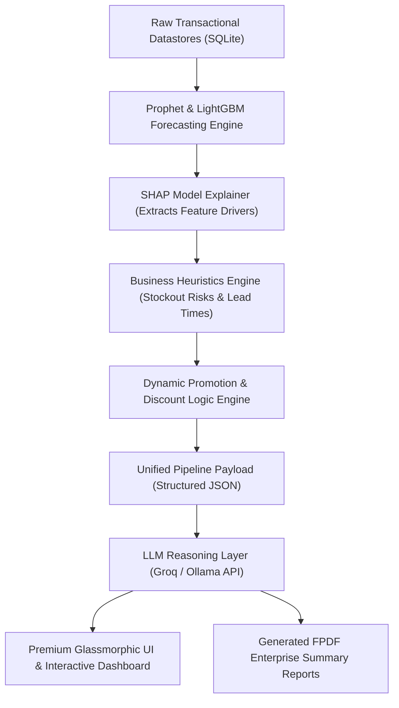

<div align="center">
  
  <h1 align="center">StockSense AI</h1>
  <p align="center">
    <strong>Predictive Supply Chain & Enterprise Intelligence for SMEs</strong>
    <br />
    Translating complex time-series ensembles and Explainable AI (XAI) metrics into plain-English, actionable business strategies.
  </p>

  <p align="center">
    
    
    
    
    
  </p>
</div>

---

## 🔮 Table of Contents
- [Overview](#-overview)
- [Key Features](#-key-features)
- [System Architecture Pipeline](#%EF%B8%8F-system-architecture-pipeline)
- [Technical Stack & Specifications](#-technical-stack--specifications)
- [Getting Started & Installation](#-getting-started--installation)
- [Configuration Environment](#-configuration-environment)
- [REST API Reference](#-rest-api-reference)
- [Example AI Insight Outputs](#-example-ai-insight-outputs)
- [License](#-license)

---

## 🔮 Overview

**StockSense AI** is an advanced, machine learning-driven inventory forecasting and business intelligence engine designed specifically for small-to-medium enterprises (SMEs). 

Traditional enterprise resources planning (ERP) platforms output dense, complex multi-dimensional dataframes and charts that require a data science background to decipher. StockSense AI closes this accessibility gap. It executes highly accurate ensemble time-series predictions, interprets features with Explainable AI (XAI) algorithms, and transforms raw telemetry into human-readable business strategies, step-by-step stock alerts, and **dynamic promotional planner cards** using large language models.

---

## ✨ Key Features

- 📈 **Hybrid Ensemble Forecasting**: Leverages combined predictions of Prophet (zero-filled, calendar-reindexed) and LightGBM engines. Delivers robust 7–30 day forecasting bounds, dynamically modeling seasonal holidays and organic promotional demand.
- 🧠 **Explainable AI (XAI) Metrics**: Employs SHAP (SHapley Additive exPlanations) TreeExplainer to break down the "black box" forecast, exposing the top mathematical variables influencing future demands.
- 🎯 **AI Promotion Recommendation Engine**: Formulates pre-holiday sales boosts, overstock liquidation alerts based on customizable safety margins, and weekend flash-sale programs in an interactive glassmorphic card deck.
- 🛒 **Consolidated Multi-Item PO Planner**: Streamlines procurement via multi-SKU checkbox selection from the power-grid. Features an interactive spreadsheet-style Draft PO modal with dynamic maximum lead-time selection, real-time cost recalculations, auto-generated professional email templates for suppliers, and transactional SQLite database persistence.
- 📥 **CSV Import Staging & Validation Console**: Supports drag-and-drop ingestion of inventory CSVs. Features automated heuristic column mapping, real-time client-side cell validation (for negatives, empty values, or malformed dates), dynamic status stats (Clean vs Erroneous rows), and click-to-edit inline cell corrections prior to database commit.
- 🗃️ **Interactive Power-Grid Catalog**: Upgrades typical datatables into a sleek, reactive data management grid. Includes real-time fuzzy search with amber-color text highlighting, instant category capsule filtering, row-by-row action triggers (single Draft PO, Delete SKU), and click-to-open drawer overlays highlighting granular individual product telemetry.
- 📊 **Visual Stock Health KPIs**: Displays real-time executive-level indicators:
  - **Stock Health Index**: The percentage of catalog products fully stocked.
  - **Out of Stock**: Counter of active critical supply stockouts.
  - **Dead Capital Tracker**: Flags stagnant inventory with zero forecasted demand and calculates tied-up capital using dynamic margin scaling.
  - **Reorder Urgency Index**: Sum of catalog items currently falling below their defined safety stock reorder thresholds.
- 💼 **Cash Flow & Capital Optimization Hub**: Renders B2B financial metrics including total inventory retail portfolio valuation, COGS-based capital allocations, category-wise asset allocations, and projected revenue/sales at risk from stockouts.
- 💬 **Stateless LLM Logic & Chat Assistant**: Couples data-rich payloads (forecast points, SHAP factors, and inventory contexts) into clean JSON structures fed to local LLMs (Ollama) or secure, stateless cloud endpoints (Groq / Llama 3.3).
- 🔒 **Edge Sovereignty & Security**: Promotes a local-first security posture. Includes secure JWT token architectures, SHA-256 password hashing, and database encryption to ensure data custody remains local.
- 🎨 **Premium Enterprise Dashboard**: Fully responsive web frontend meticulously styled with sleek dark mode aesthetics, glassmorphism panel backdrops (`blur(24px)`), smooth CSS keyframe micro-animations, and dynamic visual graphs powered by Chart.js.
- 📄 **One-Click PDF Diagnostics**: Renders compile-ready, beautiful PDF reports leveraging FPDF, summarizing critical week-over-week supply KPIs.

---

## 🏗️ System Architecture Pipeline

StockSense AI follows a deterministic, 6-stage telemetry processing pipeline to synthesize model insights:



1. **Forecasting**: Standardizes transaction timelines, applies calendar reindexing, and feeds data through Prophet and LightGBM models.
2. **Explainability**: SHAP TreeExplainer extracts shapley values to attribute the exact percentage influence of baseline trends, holidays, and pricing adjustments.
3. **Operational Calculations**: Evaluates reorder points, current inventory levels, lead-times, and calculates exact stockout thresholds.
4. **Promotion Recommendations**: Assesses inventory age, shelf-life boundaries, and sales thresholds to formulate specific markdown campaigns.
5. **Payload Compilation**: Assembles forecasting metrics, stockout warn flags, SHAP values, and suggested markdowns into a standardized JSON payload.
6. **LLM Synthesis**: Translates the telemetry payload into clear, plain-English operational instructions and conversational responses.

---

## 💻 Technical Stack & Specifications

### Backend Ecosystem
- **Core Environment**: Python 3.10+
- **API Engine**: FastAPI & Uvicorn (Asynchronous routing, structured request schemas, and high-performance throughput).
- **Machine Learning Core**: Prophet, LightGBM, and SHAP.
- **Data Engineering**: DuckDB & Pandas (optimized vector processing for fast transactional ingestion).
- **Secure Storage**: SQLite with SHA-256 cryptographic hashes.
- **Reporting System**: FPDF.

### Frontend Presentation
- **Core Stack**: Vanilla HTML5, CSS3, and JavaScript (zero bloated dependencies).
- **Data Visualizations**: Responsive Chart.js canvas elements with custom gradient fills.
- **Typography & Assets**: Outfit (Google Fonts), FontAwesome Icons, and custom drop-shadow SVGs.

---

## 🚀 Getting Started & Installation

### Prerequisites
- Python 3.10 or higher installed.
- [Ollama](https://ollama.ai/) installed locally (optional, for local LLM inference models).
- A [Groq API Key](https://groq.com/) (recommended for fast, stateless remote cloud inference).

### Installation Workflow

1. **Clone the repository**
   ```bash
   git clone https://github.com/shejanahmmed/StockSense-AI.git
   cd StockSense-AI
   ```

2. **Initialize a secure virtual environment & install requirements**
   ```bash
   # On macOS/Linux
   python3 -m venv venv
   source venv/bin/activate

   # On Windows (PowerShell)
   python -m venv venv
   .\venv\Scripts\Activate.ps1

   # Install core dependencies
   pip install --upgrade pip
   pip install -r requirements.txt
   ```

3. **Establish Local Settings**
   Generate a `.env` configuration file in the project's root folder utilizing the provided `.env.example`:
   ```bash
   # On macOS/Linux
   cp .env.example .env

   # On Windows (PowerShell)
   Copy-Item .env.example .env
   ```

---

## ⚙️ Configuration Environment

Modify the generated `.env` file to dictate environment characteristics and select your LLM model provider:

```env
# Deployment Context ('local' uses Ollama, 'production' uses Groq API)
DEPLOYMENT_ENV=production

# Groq API Gateway Credentials (Required for 'production' mode)
GROQ_API_KEY=gsk_your_secure_api_key_goes_here

# Local Ollama Host Settings (Default: http://localhost:11434)
OLLAMA_HOST=http://localhost:11434

# Security Tokens (Used to sign JWT payloads)
JWT_SECRET=super_secret_jwt_hmac_sha256_key_minimum_32_chars
JWT_ALGORITHM=HS256
```

### Running the Application

Launch the asynchronous ASGI Uvicorn server:
```bash
python -m uvicorn src.api.main:app --reload
```
Once initialized, navigate to **`http://127.0.0.1:8000`** in your browser. The embedded static files will automatically serve the glassmorphic desktop and mobile dashboards.

---

## 📊 REST API Reference

### 🔐 Authentication Management
| Method | Endpoint | Description | Auth Required |
| :--- | :--- | :--- | :--- |
| `POST` | `/api/user/signup` | Register a new enterprise profile & organization schema. | No |
| `POST` | `/api/user/login` | Authenticate credentials and issue session JWT tokens. | No |
| `GET` | `/api/user/profile/{org_name}` | Fetch active organization metadata, industry fields, and preferences. | Yes |
| `POST` | `/api/user/profile` | Update profile information (store location, business name). | Yes |
| `POST` | `/api/user/upload-avatar` | Upload custom branding logos to local image directories. | Yes |
| `DELETE` | `/api/user/purge` | Securely purge all database records associated with the user. | Yes |

### 📦 Inventory Catalog
| Method | Endpoint | Description | Auth Required |
| :--- | :--- | :--- | :--- |
| `GET` | `/api/inventory` | Retrieve standard inventory counts, classifications, and safety limits. | Yes |
| `POST` | `/api/inventory` | Provision a new product SKU into the database catalog. | Yes |
| `PUT` | `/api/inventory/{sku}` | Modify stocking details, price indices, or lead times. | Yes |
| `DELETE` | `/api/inventory/{sku}` | Permanently delete a SKU profile from inventory tracking. | Yes |

### 🔮 Forecasting & Analytics Engine
| Method | Endpoint | Description | Auth Required |
| :--- | :--- | :--- | :--- |
| `POST` | `/api/predict` | Run the ensemble forecasting engine (accepts optional sales history CSV upload) & retrain models. | Yes |
| `GET` | `/api/forecast/{sku}` | Retrieve demand forecast steps (7-30 days) and confidence limits for a SKU. | Yes |
| `GET` | `/api/insight` | Generate plain-English explanations utilizing SHAP drivers. | Yes |
| `GET` | `/api/holidays` | Return catalog of holidays contributing to seasonal model adjustments. | Yes |
| `GET` | `/api/report` | Render and export a comprehensive weekly analytical dashboard PDF report. | Yes |
| `GET` | `/api/purchase_order/draft` | Recommend reorder quantities, forecast, and COGS for a specific SKU. | Yes |

### 🛒 B2B Procurement & Purchase Orders
| Method | Endpoint | Description | Auth Required |
| :--- | :--- | :--- | :--- |
| `GET` | `/api/purchase_orders` | Fetch all purchase orders for the authenticated organization. | Yes |
| `GET` | `/api/purchase_orders/{po_id}` | Fetch details of a single purchase order along with its item breakdown. | Yes |
| `POST` | `/api/purchase_orders` | Persist a new Purchase Order along with its lines in a transaction. | Yes |
| `PUT` | `/api/purchase_orders/{po_id}/status` | Update status of a purchase order (`Pending`, `Sent`, `Completed`, `Cancelled`). | Yes |
| `DELETE` | `/api/purchase_orders/{po_id}` | Permanently delete a purchase order from the database ledger. | Yes |

### 💼 Cash Flow & B2B Campaigns
| Method | Endpoint | Description | Auth Required |
| :--- | :--- | :--- | :--- |
| `GET` | `/api/financials/summary` | Calculate retail portfolio values, tied-up COGS capital, predicted sales at risk, and historical PO spends. | Yes |
| `POST` | `/api/promotions` | Schedule a new promotion/marketing campaign to model demand impacts. | Yes |
| `GET` | `/api/promotions` | Fetch all scheduled promotions for the organization. | Yes |
| `DELETE` | `/api/promotions/{id}` | Cancel/delete a scheduled promotion by ID. | Yes |

### 💬 AI Interactive Chat Assistant
| Method | Endpoint | Description | Auth Required |
| :--- | :--- | :--- | :--- |
| `POST` | `/api/chat` | Query the model regarding specific SKU warnings or optimizations. | Yes |
| `GET` | `/api/chat/history` | Retrieve local contextual conversation history. | Yes |
| `DELETE` | `/api/chat/history` | Reset the user's conversational chat history. | Yes |

---

## 📊 Example AI Insight Outputs

The following is an example of what an SME business owner reviews on their glassmorphic dashboard interface:

> ### 🔮 AI Forecast Diagnosis & Strategy — Electronics
>
> Overall store demand is predicted to rise **+24.5%** next week, reaching an estimated **5,120 transactions**. 
>
> **Drivers (Explainable AI Attributes):**
> * 📈 **Pre-Holiday Lift (Black Friday Prep):** +18.2% (Historical seasonal index trigger).
> * 🏷️ **Active Organization Promotion:** +5.3% (Multiplied response rate).
> * 🌦️ **Localized Climate Trend:** +1.0% (Subtle feature coefficient).
>
> ---
>
> ### ⚠️ Inventory Risks & Action Plan
> * **Stockout Alert (SKU: `LAP-COOL-RGB`)**: At current sales velocity, your 3,100 physical stock balance will be exhausted by Thursday morning. 
> * **Recommendation**: Place an immediate replenishment order for **2,150 units** with your vendor (Lead-time standard: 3 business days).
>
> ---
>
> ### 🏷️ Dynamic Campaign Planner Recommendations
> * **Festive Boost Strategy**: Standardize a 15% markdown campaign for high-visibility display items starting Tuesday morning.
> * **Overstock Liquidation**: `Mechanical Keyboards USB-C` (SKU: `KB-MECH-99`) is currently sitting at 45% above your defined optimal storage capacity. Launch a 3-day **25% off Flash Sale** to release capital.

---

## 🤝 Contributing

Contributions are welcome! Please open an issue or submit a pull request if you notice bugs, want to add features, or wish to enhance our machine learning baseline models.

---

## 🛡️ License

Distributed under the **MIT License**. See `LICENSE` for more information.

---
*Developed with ❤️ to empower small businesses with accessible, enterprise-grade AI analytics.*
